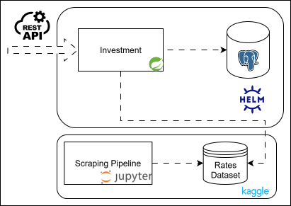

# Invest


## Description
Investment simulation and storage for different types of fixed income:
Name | Description | Has taxes
:---: | :---: | :---:
CDB | *Certificado de Depósito Bancário* | **:heavy_check_mark:**
RDB | *Recibo de Depósito Bancário* | **:heavy_check_mark:**
LCA | *Letra de Crédito do Agronegócio* | **:x:**
LCI | *Letra de Crédito Imobiliário* | **:x:**
CRA | *Certificado de Recebíveis do Agronegócio* | **:x:**
CRI | *Certificado de Recebíveis Imobiliários* | **:x:**
### Investment Aliquot Type
Type | Format | Example
:---: | :---: | :---:
PREFIXED | `x%` | 10%
INFLATION | `IPCA + x%` | IPCA + 5%
POSTFIXED | `x%` | 110% (SELIC based)
* SELIC and IPCA are retrieved from [this dataset](https://www.kaggle.com/datasets/hssiqueira/brazil-interest-rate-history-selic).
* Interest rates are being updated on:
    * Every application startup;
    * Every API call `[POST] /api/v1/rates`;
    * Every day by CRON.
## Executing
* Kaggle API credentials is required to populate the database to perform SELIC and IPCA calculations.

Generate the docker image with:
```shell
mvn clean package -Pdocker
```
* Adjust database connection and other properties to execute the application.
### Kubernetes
Check [this README](/helm/README.md)
### Architecture


